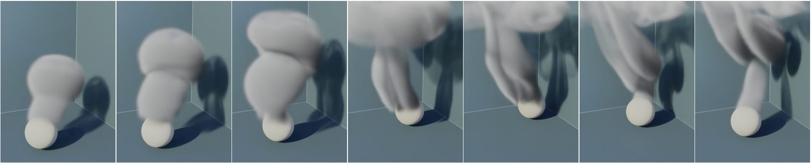

# Latent Space Subdivision
## Stable and Controllable Time Predictions for Fluid Flow

This is the source repository for the paper [Latent Space Subdivision].

[Latent Space Subdivision]: https://ge.in.tum.de/publications/2020-lssubdiv-wiewel/       "Latent Space Subdivision: Stable and Controllable Time Predictions for Fluid Flow"

The source code of this work is based on [Deep Fluids: A Generative Network for Parameterized Fluid Simulations. Kim et al. (2019)](https://github.com/byungsook/deep-fluids) and [Latent Space Physics: Towards Learning the Temporal Evolution of Fluid Flow. Wiewel et al. (2019)](https://github.com/wiewel/LatentSpacePhysics).

## Authors
* [Steffen Wiewel¹](https://ge.in.tum.de/about/steffen-wiewel/)
* [Byungsoo Kim²](http://www.byungsoo.me)
* [Vinicius C. Azevedo²](http://graphics.ethz.ch/~vviniciu/)
* [Barbara Solenthaler²](https://graphics.ethz.ch/~sobarbar/)
* [Nils Thuerey¹](https://ge.in.tum.de/about/n-thuerey/)

¹Technical University of Munich, ²ETH Zurich

## Abstract
We propose an end-to-end trained neural network architecture to robustly predict the complex dynamics of fluid flows with high temporal stability. We focus on single-phase smoke simulations in 2D and 3D based on the incompressible Navier-Stokes (NS) equations, which are relevant for a wide range of practical problems. To achieve stable predictions for long-term flow sequences, a convolutional neural network (CNN) is trained for spatial compression in combination with a temporal prediction network that consists of stacked Long Short-Term Memory (LSTM) layers. Our core contribution is a novel latent space subdivision (LSS) to separate the respective input quantities into individual parts of the encoded latent space domain. This allows to distinctively alter the encoded quantities without interfering with the remaining latent space values and hence maximizes external control. By selectively overwriting parts of the predicted latent space points, our proposed method is capable to robustly predict long-term sequences of complex physics problems. In addition, we highlight the benefits of a recurrent training on the latent space creation, which is performed by the spatial compression network.

- [Project Website](https://ge.in.tum.de/publications/2020-lssubdiv-wiewel/)
- [Paper, arXiv:2003.08723](https://arxiv.org/abs/2003.08723)

## Prerequisites

This installation guide focusses on Ubuntu 16.04 as a distribution. The process will however look very similar with other distributions, the main differences being the package manager and library package names.

Required Packages:
- [Anaconda / python3.6](https://www.anaconda.com/download/)
- [TensorFlow 1.11](https://www.tensorflow.org/install/)
- [tqdm](https://github.com/tqdm/tqdm)
- [phiflow](https://github.com/tum-pbs/PhiFlow)
- [mantaflow](http://mantaflow.com/)
- [ffmpeg (generate videos of results)](https://www.ffmpeg.org/)

Make sure you have checked out the git repositroy including its referenced submodules. The directory structure of the following explanations depends on the correct submodule paths.

### Install Mantaflow first

First, install a few pre-requisites:

`sudo apt-get install cmake g++ git python3-dev qt5-qmake qt5-default`

Then, change to the directory to install the source code in, and obtain the current sources from the repository (or alternatively download and extract a source code package)

`cd <gitdir>`

To build the project using CMake, set up a build directory and choose the build options

`mkdir Mantaflow/build`

`cd Mantaflow/build`

`cmake .. -DGUI=ON -DOPENMP=ON -DNUMPY=ON -DPYTHON_VERSION=3.6`

`make -j4`

That's it! You can now test mantaflow using an example scene

`./manta ../scenes/simpleplume.py`

Common Linux problems:

- In conjunction with tensorflow, it can easily happen these days that you have multiple version of python installed. If cmake for mantaflow finds a different one than you're using for tensorflow, you will get errors such as ''ImportError: no module named XXX''. To fix this problem, manually select a python version in cmake with -DPYTHON_VERSION=X.Y
- It is also possible to directly specify the directory in which the python installation resides as follows:
    - `DPYTHON_INCLUDE_DIR=/PATH/TO/PYTHONENV/include/python3.6m `
    - `DPYTHON_LIBRARY=/PATH/TO/PYTHONENV/lib/libpython3.6m.so`

Further information on the installation process can be found on the project website http://mantaflow.com/.

### Setup TensorFlow

The code was created and tested with TensorFlow 1.11.0, CUDA V10.1.168, CUDNN 7.4.1, Keras 2.2.4.

If errors arise make sure your installation is correct.

After checking your installation install the following packages:

`pip install tensorflow-gpu keras numpy sklearn imageio scipy matplotlib h5py scikit-image gitpython phiflow`

## Generate the Dataset

In this example we generate a simple 2D dataset of resolution 32x64. The following commands generate a dataset with 50 different random initializations and 400 consecutive steps to train our latent space subdivision network on.

Make sure you are in the *\<gitdir\>/* directory.

`./Mantaflow/build/manta scene/smoke_mov.py --resolution_x=32 --resolution_y=64 --num_scenes=50 --num_frames=400 --output_images`

Your dataset should be placed in the *\<gitdir\>/data/smoke_mov50_f400/* directory after the call finished.

## Train the Network

Before continuing make sure you are in the *\<gitdir\>/* directory.

With the following command we train a model on the previously generated dataset. Our dataset is 2D, since it was generated with a resolution of 32x64. Hence, we also must train a 2D network by appending the following call with `--res_z=1`. 

`python keras_models_combined.py --title=Example --tag=12io_2to1_LSSplit_SP --z_num=16 --is_train=True --batch_size=16 --dataset=smoke_mov50_f400 --input_frame_count=14 --w_num=2 --decode_predictions=True --pred_gradient_loss=True --ls_supervision=True --epochs=10 --data_type velocity density inflow --ls_split=0.66 --res_x=32 --res_y=64 --res_z=1`

Please consider taking a look at the `config.py` in the main directory for further information about additional calling arguments.

The trained network is placed in *\<gitdir\>/log/ae/velocity_density_inflow/smoke_mov50_f400/Example/~Date~_~ToD~_12io_2to1_LSSplit_SP/*.

## Evaluate the Results

To generate predictions with your new models call the `pred_smoke_mov`scene with mantaflow and point to your network by supplying the `load_path` argument.

`./Mantaflow/build/manta scene/pred_smoke_mov.py --load_path="<gitdir>/log/ae/velocity_density_inflow/smoke_mov50_f400/Example/~Date~_~ToD~_12io_2to1_LSSplit_SP/checkpoint/" --seed 1234 --num_frames=250 --warmup_steps=30 --output_images --num_scenes=5 --prediction_type=vel_prediction`

The results are placed under *\<gitdir\>/prediction/pred_smoke_mov/~Date~_~ToD~_12io_2to1_LSSplit_SP/vel_prediction/001234/*.

## Trained Model and Simulation Data

The following links contain a trained 2D moving smoke model and the dataset it was trained on. The dataset contains 200 scenes with 600 consecutive simulation steps each.
After unpacking, the dataset must be copied to the *\<gitdir\>/data/* directory, whereas the unpacked network model must be placed in the *\<gitdir\>/log/* directory.

### Downloads
Use the command `tar xfvz archive.tar.gz` to decompress the following archives.
- [2D Moving Smoke Model [TODO]](http://ge.in.tum.de/download/TODO.tar.gz)
- [2D Moving Smoke Dataset (200 scenes with 600 frames each) [TODO]](http://ge.in.tum.de/download/TODO.tar.gz)

### The final paths should look like:
- 2D Moving Smoke Model: `<gitdir>/log/ae/velocity_density_inflow/smoke_mov200_f600/GitHubExample/0324_145437_12io_2to1_LSSplit_SP`
- 2D Moving Smoke Dataset: `<gitdir>/data/smoke_mov200_f600`

### Commands:
`./Mantaflow/build/manta scene/smoke_mov.py --resolution_x=32 --resolution_y=64 --num_scenes=200 --num_frames=600 --output_images`

`python keras_models_combined.py --title=GitHubExample --tag=12io_2to1_LSSplit_SP --z_num=16 --is_train=True --batch_size=32 --dataset=smoke_mov200_f600 --input_frame_count=14 --w_num=2 --decode_predictions=True --pred_gradient_loss=True --ls_supervision=True --epochs=20 --data_type velocity density inflow --ls_split=0.66 --res_x=32 --res_y=64 --res_z=1`

`./Mantaflow/build/manta scene/pred_smoke_mov.py --load_path="log/ae/velocity_density_inflow/smoke_mov200_f600/GitHubExample/0324_145437_12io_2to1_LSSplit_SP/" --seed 1234 --num_frames=200 --warmup_steps=30 --output_images --num_scenes=5 --prediction_type=vel_prediction`

